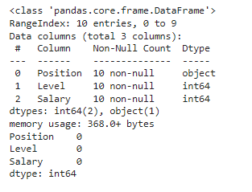
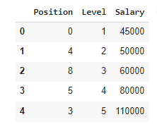
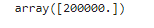

# Implementation-of-Decision-Tree-Regressor-Model-for-Predicting-the-Salary-of-the-Employee

## AIM:
To write a program to implement the Decision Tree Regressor Model for Predicting the Salary of the Employee.

## Equipments Required:
1. Hardware – PCs
2. Anaconda – Python 3.7 Installation / Moodle-Code Runner

## Algorithm
1.Import pandas modules to start with program.
2.Read csv file and store it in a variable.
3.From sklearn import label encoder to fit attribute.
4.Import train_test_split to get train and test datasets.
5.Using DecisionTreeRegressor predict the value. 
 

## Program:
```

Program to implement the Decision Tree Regressor Model for Predicting the Salary of the Employee.
Developed by: M.Shyam naveen raj 
RegisterNumber: 212221230099  

```
~~~
import pandas as pd
data=pd.read_csv("Salary.csv")
data.head()
data.info()
data.isnull().sum()
from sklearn.preprocessing import LabelEncoder
le=LabelEncoder()
data["Position"]=le.fit_transform(data["position"])
data.head()
x=data[["position","level"]]
y=data["salary"]
from sklearn.model_selection import train_test_split
x_train,x_test,y_train,y_test = train_test_split(x,y,test_size=0.2,random_state=2))
from sklearn.tree import DecisionTreeRegressor
dt=DecisionTreeRegressor()
dt.fit(x_train,y_train)
y_pred=dt.predict(x_test)

from sklearn import metrics
mse=metrics.mean_sqaured_error(y_test,y_pred)
mse
r2=metrics.r2_score(y_test,y_pred)
r2
dt.predict([[5,6]])
~~~

## Output:
### DATA HEAD AND INFO

### DATA HEAD

### PREDICTED VALUE

## Result:
Thus the program to implement the Decision Tree Regressor Model for Predicting the Salary of the Employee is written and verified using python programming.
